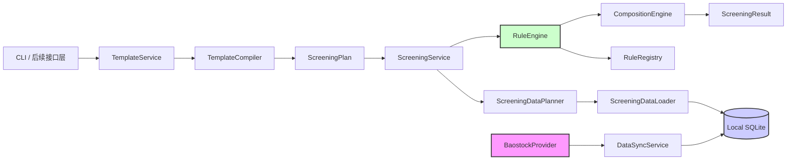

# StockManager 第二阶段计划：参数化可扩展规则后端

当前架构、实现与审查代理为 Codex。本文由 Codex 根据现有代码、P1 验收文档和用户已确认的设计方向直接起草并审查。

StockManager 是 A 股研究型筛选平台，禁止自动交易；所有筛选结果仅供研究参考，不构成任何投资建议。

## 阶段目标

P2 将当前“固定 `RulesConfig`、固定规则调用顺序、固定组合逻辑”的筛选内核，升级为参数可严格校验、规则可显式注册、组合可配置、模板可版本化保存的后端内核。

完成后，新增类似 `annual_min_volume` 的规则时，应主要通过新增独立规则模块、参数模型、数据需求声明和注册项完成，不再修改筛选主循环或组合引擎。筛选路径继续只读本地 SQLite，所有规则继续保持无网络、无存储副作用。

### 本阶段范围

- 规则定义、强类型参数、数据需求和显式注册机制。
- 版本 2 模板结构、严格解析、校验和执行计划编译。
- `all`、`any` 与显式分组组合。
- `PASSED`、`FAILED`、`SKIPPED` 规则执行状态及兼容迁移。
- 启用规则的数据需求合并与本地批量读取。
- 现有七条基础规则迁入统一执行框架。
- 新增“目标日是否为向前 365 个自然日窗口最低交易量”规则。
- 系统模板与用户模板的安全本地持久化。
- `ScreeningService` 与 CLI 对新执行计划的兼容迁移。
- 完整离线测试、技术文档和 Obsidian 同步。

### 排除范围

- HTML、CSS、JavaScript 和 Web 页面。
- FastAPI、Flask 或其他 HTTP 框架选型与实现。
- 用户登录、权限、多租户和远程模板共享。
- 运行时上传、下载或执行第三方 Python 规则。
- 自动扫描任意目录并导入不受信任模块。
- 自动交易、下单、回测、实时行情和投资建议。
- 更换 Baostock 或增加新的市场数据 Provider。
- 规则自行访问 SQLite、Provider、网络、系统时间或文件。

## 当前基线

P1 已建立以下稳定数据流：

```text
BaostockProvider
  -> DataSyncService
  -> SQLiteRepository
  -> ScreeningService
  -> 纯函数 Rules
  -> CLI
```

当前内核包含 `pe_positive`、`non_st`、`dividend_3y`、`volume_price_5d`、`limit_up_breakout`、`limit_up_3m`、`volatility_multiple` 七条基础规则，以及固定的 `composite` 组合规则。

当前 `ScreeningService` 持有一套 `RulesConfig`，逐条硬编码调用规则。配置文件版本为 1；组合关系、规则启用状态和模板生命周期尚不可配置。现行新内核测试套件为 65 个离线测试；真实 Baostock 仅完成有界契约冒烟，不代表生产部署或全市场容量验收。

## 目标架构与数据流



强制边界：

- `BaostockProvider` 等外部数据源仍只能由 `DataSyncService` 调用。
- `ScreeningService`、数据规划器、规则引擎、组合引擎、CLI 查询和后续 API 只能读取本地数据。
- `RuleContext` 不得包含 Provider、Repository、数据库连接、HTTP 请求或系统当前时间。
- 模板只引用稳定 `rule_id`，不得提供 Python 导入路径。
- 规则注册采用后端显式可信注册，不提供任意代码执行入口。

## 拟定核心契约

以下名称和边界属于 P2 计划，必须在 P2-0 ADR 中确认后才能成为代码事实。

### 规则定义与注册

- `RuleDefinition`：描述稳定 `rule_id`、显示名称、规则说明、参数定义和数据需求。
- 规则专属参数对象：将模板 JSON 严格转换为不可变、强类型参数。
- `RuleRegistry`：显式注册规则，拒绝重复 ID，按 ID 查找规则并列出规则定义。
- `RuleContext`：提供单只股票执行所需的只读领域数据。
- `RuleDataRequirement`：声明股票身份、基本面、分红和行情窗口需求。

行情窗口至少区分：

- `calendar_days`：自然日窗口。
- `trading_sessions`：有效交易日窗口。

### 模板与执行计划

模板元数据至少区分：

- `schema_version`：模板结构版本。
- `template_id`：模板稳定标识。
- `revision`：同一模板的修改修订号。
- `name`、`description`。
- `timezone`，固定校验为 `Asia/Shanghai`。
- `technical_adjustment`，必须显式记录。

每条规则统一包含：

```text
enabled
parameters
```

`TemplateCompiler` 负责将外部模板编译为不可变 `ScreeningPlan`，并拒绝未知字段、未知规则、无效参数、重复规则、组合遗漏和无规则可执行等错误。

### 规则状态与组合

计划引入：

```text
PASSED
FAILED
SKIPPED
```

禁用规则不得伪装成通过。`RuleResult.passed`、CLI JSON 和现有调用方如何兼容三态结果，必须先形成 ADR 并以迁移测试固定，不能在实现中临时决定。

`CompositionEngine` 只根据 `rule_id` 和执行状态运算，支持：

- 组内 `all`。
- 组内 `any`。
- 顶层组合多个分组。
- 禁用规则不参与组合。

每条启用规则必须恰好出现在一个有效组中；所有规则均禁用时必须拒绝执行。

## 任务分解

### P2-0：契约盘点、ADR 与迁移基线

- **状态**：已完成（2026-08-25）。
- **目标**：在修改代码前固定 P1 公共契约，确认 P2 的领域状态、模板版本和兼容策略。
- **产物**：
  - P2 架构 ADR。
  - `RuleResult` 三态迁移 ADR。
  - 模板版本 2 结构说明。
  - CLI 兼容矩阵和 P1 基线测试记录。
  - 精确受影响文件清单。
- **验收条件**：
  - 明确哪些现有导入路径保持兼容、哪些需要迁移适配器。
  - 明确 `SKIPPED` 在领域对象和 JSON 输出中的表示方式。
  - 明确版本 1 配置的读取、迁移或拒绝策略。
  - 明确 `annual_min_volume` 的组合归属；未确认前不得实现默认组合。
  - 本任务不修改业务行为。
- **依赖**：P1-7。

### P2-1：规则抽象、参数契约与显式注册表

- **状态**：已完成（2026-08-25）。
- **目标**：建立统一、可测试且不依赖存储的规则扩展契约。
- **产物**：
  - 规则定义和参数描述领域对象。
  - 强类型参数解析边界。
  - `RuleContext` 和 `RuleDataRequirement`。
  - `RuleRegistry` 及默认可信规则注册入口。
  - 注册表与契约单元测试。
- **验收条件**：
  - 重复 `rule_id`、空 ID 和未知规则均显式失败。
  - 注册表不扫描任意目录，不根据模板动态导入 Python。
  - 规则契约不包含 Provider、Repository 或数据库连接。
  - 所有新增函数和方法具有完整类型标注。
- **依赖**：P2-0。

### P2-2：版本 2 模板解析与严格编译

- **状态**：已完成（2026-08-25）。
- **目标**：把模板 JSON 转换为经过验证的不可变执行计划。
- **产物**：
  - 模板元数据、规则配置和组合配置模型。
  - 严格模板加载器。
  - `TemplateCompiler`。
  - `ScreeningPlan`。
  - 系统默认版本 2 模板及版本 1 兼容策略实现。
- **验收条件**：
  - 未知字段、错误类型、非法 Decimal、无效时区和复权枚举显式失败。
  - 未知规则、重复组合引用、启用规则遗漏和全禁用配置显式失败。
  - `schema_version`、`template_id` 与 `revision` 不得混用。
  - 模板不得包含数据库绝对路径、Provider 凭据、目标交易日或临时股票列表。
  - 编译后的计划不再对每只股票重复解析 JSON。
- **依赖**：P2-1。

### P2-3：数据需求规划与本地批量加载

- **状态**：已完成（2026-08-25）。
- **目标**：根据全部启用规则的数据需求，生成最小且完整的本地读取计划。
- **产物**：
  - `ScreeningDataPlanner`。
  - `ScreeningDataLoader`。
  - 自然日、交易日窗口合并逻辑。
  - 数据覆盖和样本完整性测试。
- **验收条件**：
  - 同时支持自然日和交易日窗口，禁止把两者互相替代。
  - 多条规则共享的数据通过 Repository 批量读取，不逐规则查询。
  - 数据加载路径只依赖 `LocalRepositoryProtocol`，不持有 Provider。
  - 本地历史覆盖不足时保留可判定的“样本不足”信息，不冒充完整窗口。
  - 复权方式从请求、模板和数据集元数据三方显式核对。
- **依赖**：P2-1、P2-2。

### P2-4：RuleEngine 与 CompositionEngine

- **状态**：已完成（2026-08-25）。
- **目标**：统一执行启用规则，并以独立组合引擎计算总体结果。
- **产物**：
  - `RuleEngine`。
  - `CompositionEngine`。
  - 三态规则执行结果。
  - `all`、`any`、分组和顶层组合测试。
- **验收条件**：
  - 禁用规则明确为 `SKIPPED`，不伪装成 `PASSED`。
  - 空组、全跳过组、单规则组和嵌套顶层组合语义有固定测试。
  - 规则普通不通过返回结构化失败；数据契约错误继续抛出明确异常。
  - 组合引擎不包含 PE、成交量、涨停等具体业务判断。
- **依赖**：P2-1、P2-2。

### P2-5：现有规则迁入统一执行框架

- **状态**：已完成（2026-08-25）。
- **目标**：在保持已验收规则语义的前提下，将七条基础规则接入注册、参数和数据需求机制。
- **产物**：
  - 七条基础规则的定义、强类型参数和数据需求声明。
  - 现有默认组合的版本 2 表达。
  - P1 配置与筛选结果兼容回归测试。
- **验收条件**：
  - 固定 fixtures 下，启用全部现有规则时的通过/失败业务语义保持一致。
  - 规则仍为纯计算，不读网络、数据库、文件或系统时间。
  - 当前规则导入兼容策略符合 P2-0 ADR。
  - 默认模板的复权方式仍然明确记录，不形成系统级隐式默认。
- **依赖**：P2-3、P2-4。

### P2-6：年度最低交易量规则

- **状态**：已完成（2026-08-25）。
- **目标**：新增可参数化的 `annual_min_volume` 纯规则，并验证新规则扩展流程不要求修改筛选主循环。
- **计划语义**：
  - 窗口为 `[target_day - lookback_calendar_days, target_day]`，默认 365 个自然日。
  - 仅统计 `is_trading=True` 的交易条目。
  - `exclude_zero_volume` 默认 `true`。
  - 目标日必须是有效交易日；默认情况下目标日成交量必须非零。
  - 目标日成交量等于窗口最小值即通过，并列最低允许通过。
  - `minimum_required_trading_sessions` 默认 120。
- **产物**：
  - 规则定义、强类型参数、数据需求和纯函数实现。
  - 注册项和默认模板配置。
  - 规则单元测试和语义文档。
- **验收条件**：
  - `actual_value` 至少报告目标量、窗口最小量、最低量日期和有效样本数。
  - `threshold` 明确窗口长度、比较语义和零量处理。
  - 覆盖停牌、零量、并列最低、非最低、样本不足、窗口边界、空数据、乱序、重复交易日、混合股票代码和缺失数值。
  - 样本不足返回明确筛选失败；重复日、混合代码、复权不匹配等数据契约错误显式抛异常。
  - 不完整本地历史不得被表述为“全年最低”。
  - 组合归属必须采用 P2-0 经用户确认的决定。
- **依赖**：P2-3、P2-4、P2-5；组合归属决策门。

### P2-7：模板持久化服务

- **状态**：已完成（2026-08-25）。
- **目标**：提供可替换存储边界下的系统模板和用户模板生命周期管理。
- **产物**：
  - 模板 Repository 协议。
  - JSON 文件模板 Repository。
  - `TemplateService` 的创建、读取、更新、删除和另存为操作。
  - 系统模板只读保护、原子写入和 revision 并发检查。
- **验收条件**：
  - 用户提供的名称不能直接成为未校验文件路径。
  - 路径穿越、符号链接逃逸、非法 ID 和覆盖系统模板均被拒绝。
  - 保存前必须成功完成全量模板编译校验。
  - 更新成功后 `revision` 单调递增；过期 revision 更新显式冲突。
  - 写入失败不能留下半份模板，测试验证原子替换语义。
  - 删除只允许用户模板，并明确不存在与冲突行为。
- **依赖**：P2-2。

### P2-8：ScreeningService 与 CLI 兼容迁移

- **状态**：已完成（2026-08-25）。
- **目标**：让筛选服务编排模板、执行计划、数据加载和规则组合，同时保持离线 CLI 可用。
- **产物**：
  - 新版 `ScreeningService` 编排实现。
  - 保存模板与临时未保存配置两种运行入口的应用服务契约。
  - CLI 参数和 JSON/summary 输出兼容层。
  - 结构化错误映射。
- **验收条件**：
  - 筛选服务不再逐条硬编码规则调用。
  - 临时配置运行不修改已保存模板。
  - CLI 在断网环境仍可使用本地数据筛选。
  - P1 CLI 兼容行为按 P2-0 矩阵验证；有意变更必须有版本说明和测试。
  - 数据缺失时明确报告本地数据不可用，不自动调用同步。
- **依赖**：P2-4、P2-5、P2-6、P2-7。

### P2-9：离线端到端验收、文档与 Obsidian 同步

- **状态**：已完成（2026-08-25）。
- **目标**：验证“模板加载或临时配置 → 编译计划 → 本地批量读取 → 规则执行 → 组合结果”的完整闭环。
- **产物**：
  - P2 端到端测试。
  - 规则扩展示例测试。
  - 更新后的架构、模板、规则和 CLI 文档。
  - Obsidian 项目文档同步副本。
- **验收条件**：
  - 全部测试默认离线并使用固定 fixtures 或临时 SQLite。
  - 测试证明筛选路径不构建、不持有、不调用 Provider。
  - 新增测试用示例规则时无需修改筛选服务和组合引擎。
  - 模板增删改查、临时运行、三态结果、组合边界和年度最低量均通过端到端验证。
  - 文档与真实代码一致，计划状态和完成状态不混写。
  - 所有新增或修改文档均具有强制 frontmatter 并同步 Obsidian。
- **依赖**：P2-8。

## 测试矩阵

| 范畴 | 必测场景 |
|---|---|
| 注册表 | 重复 ID、空 ID、未知 ID、注册顺序稳定、禁止动态导入 |
| 参数 | 错误类型、未知字段、缺字段、非法 Decimal、零值、负值、上下限倒置 |
| 模板 | 错误 schema、非法时区、复权不匹配、启用规则遗漏、重复组引用、全禁用 |
| 组合 | `all`、`any`、单规则、空组、全 SKIPPED、组间顶层组合 |
| 状态迁移 | PASSED、FAILED、SKIPPED、现有 CLI JSON 和 summary 兼容 |
| 数据规划 | 自然日与交易日窗口、多个窗口合并、数据不足、明确复权 |
| 行情数据 | 空集合、乱序、重复交易日、混合代码、None/NaN、停牌、零成交量 |
| 年度最低量 | 窗口首尾、并列最低、非最低、样本不足、新股、目标日停牌或零量 |
| 模板存储 | 路径穿越、系统模板只读、非法 ID、原子写入、revision 冲突、删除不存在 |
| 架构隔离 | 断网筛选、Provider 故障不影响本地筛选、规则和筛选服务无 Provider |
| 回归 | 七条现有规则 fixtures、默认组合、CLI 单只/批量、JSON/summary、错误出口 |

## 实现前决策门

以下问题必须在对应任务开始前由用户或 ADR 明确，Codex 不得擅自替代业务决策：

1. `annual_min_volume` 加入信号组作为 `any` 候选，还是作为独立必须满足的硬条件。
2. `RuleResult` 三态表示是直接调整 `passed` 类型，还是引入兼容结果对象；CLI 如何版本化。
3. 版本 1 配置自动迁移、只读兼容或明确拒绝的策略。
4. 用户模板冲突控制采用显式期望 revision 的具体应用服务契约。
5. 系统默认模板是否包含并默认启用 `annual_min_volume`；若启用，其组合归属必须与第 1 项一致。

## 风险与缓解

- **规则框架过度抽象**：先只覆盖当前规则真实需要的数据类型和两种窗口单位，不设计任意脚本或第三方插件系统。
- **兼容性破坏**：以 P1 fixtures、CLI 快照和 P2-0 兼容矩阵作为迁移门禁。
- **窗口数据不完整**：数据规划显式报告覆盖范围，年度最低量不得把局部数据误报为全年结论。
- **自然日与交易日混淆**：需求模型使用明确枚举，并分别测试边界。
- **模板路径安全**：调用方只传模板稳定 ID，文件名和根目录由 Repository 控制，拒绝路径逃逸。
- **模板并发覆盖**：原子写入结合 revision 冲突检查，禁止静默覆盖较新版本。
- **规则异常被误判为失败**：普通条件不满足返回 `FAILED`；结构、复权和配置错误继续显式抛出。
- **筛选路径意外联网**：架构测试验证 `ScreeningService`、RuleEngine 和规则均不依赖 Provider。
- **复权隐式化**：模板、请求和数据集元数据三方均明确记录并校验复权。

## 完成定义

P2 只有在以下条件全部满足后才可标记完成：

1. 规则注册、模板编译、数据规划、规则执行和组合计算职责分离。
2. 筛选路径只读取本地 SQLite，不持有或调用 Provider，断网可正常筛选已有数据。
3. 所有新增或修改函数具有完整类型标注，无吞异常、无硬编码本机绝对路径。
4. 七条现有规则在固定 fixtures 下完成兼容迁移。
5. `annual_min_volume` 的业务语义、组合归属、边界和结果结构已确认并通过离线测试。
6. 模板的严格校验、只读系统模板、安全路径、原子写入和 revision 冲突均有测试。
7. 关键边界、缺失值、停牌、ST、涨跌停、空数据和乱序数据均有相应覆盖。
8. CLI 兼容行为经过回归验收；有意变化具有 ADR、版本说明和测试。
9. 技术文档与真实代码一致，全部具有规定 frontmatter，并同步到 Obsidian Vault。
10. Codex 完成代码审查、离线测试和最终验收。
11. Git 提交按明确目的拆分并使用 Conventional Commits，敏感文件、缓存、构建产物和 Excel 输出未进入仓库。

## 后续阶段

P2 完成后再进入前端阶段。后续前端可以消费稳定的规则目录、模板应用服务和参数化筛选契约，但具体 HTML 页面、HTTP API、框架和交互设计不属于本计划，也不在 P2 中提前承诺。
