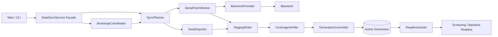

# P5_RECONSTRUCT_DATASYNC：数据同步重构计划

## 0. 文档定位

本计划重构 StockManager 从 Baostock 到本地 SQLite 的同步链路，解决当前同步速度受上游串行能力限制时，服务层状态复杂、半成品数据提前对筛选可见、coverage 不能证明逐日完整、generation 只是元数据而不是可发布快照的问题。

本计划不切换数据源，不引入自动交易，不允许筛选、规则、回测、API 或 CLI 绕过本地数据库直接访问 Baostock。现有 `DataSyncService` 保留为唯一外部数据入口和兼容门面，内部拆分为可测试组件。

本文件只定义架构、接口边界、迁移顺序、任务包和验收标准，不代表功能已经实现。

### 0.1 AI 分工声明

- 架构与任务拆分代理：**Codex**。
- 实现、测试、调试、数据库迁移、代码审查与最终技术验收代理：**DeepSeek V4 Flash**。
- 文档助手：**Qwen3.8:27b**，仅在真实代码契约稳定并通过技术验收后，根据完整任务包起草注释和 Markdown 技术文档。
- Codex 本轮只交付本计划，不修改业务代码、测试、配置或数据库。

### 0.2 产品与数据边界

1. StockManager 继续定位为 A 股研究型筛选平台，严禁自动交易。
2. Baostock 继续作为当前数据源；Provider 接口必须可替换，业务层不得出现 Baostock 特定逻辑。
3. Baostock 只能由 `DataSyncService` 同步门面调用，且请求必须受控串行、限速、超时并支持会话失效后的重登录。
4. 筛选和回测必须断网可运行，只能读取本地已发布 generation。
5. 复权方式必须作为计划、任务、批次、coverage、generation 和读取请求的显式字段；通用同步组件不得自行决定默认复权方式。
6. 所有日期按 `Asia/Shanghai` 和 A 股交易日历计算，禁止以自然日前一天代替上一交易日。

## 1. 当前源码事实与重构原因

### 1.1 当前可复用能力

| 能力 | 当前实现 | 重构后的去向 |
|---|---|---|
| Provider 抽象 | `providers/baostock_provider.py` | 保留在 `SerialFetchWorker` 后方 |
| 外部数据单一入口 | `sync/data_sync_service.py` | 保留为同步门面，不再承担全部内部状态 |
| 进程锁与文件锁 | 当前同步流程已有 | 由同步门面和 Worker 复用 |
| 串行限速、超时、重登录 | Baostock Provider 已有部分机制 | 固化为 Worker 契约并补故障测试 |
| v2 run/chunk checkpoint | `backfill_runs_v2`、`backfill_chunks_v2` | 迁移为确定性 plan/task checkpoint |
| coverage 与 generation 元数据 | `dataset_coverage`、`dataset_versions` | 迁移为逐分区验证和显式 active generation |
| PIT Reader generation 绑定 | `read/historical.py` | 改由 `ReadinessGate` 返回已发布快照 |
| 数据库只读完整性脚本 | `storage/integrity.py` | 作为 verifier 的结构检查之一 |

### 1.2 当前必须修复的问题

1. **半成品可见**：bars、fundamentals、stocks 和 metadata 在每个 chunk 完成后直接写正式表；整体同步失败时，筛选仍可能读到本轮半成品。
2. **coverage 证据不足**：当前 `actual_coverage()` 主要以 `MIN/MAX` 日期判断边界，不能证明目标区间内每个交易日、每个应有股票和每种数据类型都完整。
3. **generation 未绑定实际行**：`dataset_versions` 保存 generation 元数据，但行情行没有 generation/批次归属，Reader 读取的仍是共享正式表。
4. **成功状态混淆**：当前流程尝试 `_commit_generation()` 后仍可把 backfill run 和 sync record 写成 `SUCCESS`；Provider 流程完成不等于数据完整，也不等于 generation 已发布。
5. **读取门禁不足**：Reader 能读取最新 `COMPLETE` generation 名称，但数据查询没有通过 active generation 的分区清单约束。
6. **种子校验未形成实现闭环**：现有 ADR 要求种子携带 SHA-256，但当前代码没有完成“外部 manifest 校验 → staging 导入 → coverage 验证 → generation 发布”的完整契约。
7. **新用户初始化过慢**：仅依靠 Baostock 串行拉取八年全市场需要数小时，必须支持种子基线和断点续传的在线 Bootstrap。
8. **跨平台迁移缺少正式流程**：SQLite 文件本身跨平台，但当前没有把 WAL checkpoint、SHA-256、schema、generation、coverage 和尾部增量规划串成可验收流程。

## 2. 目标与非目标

### 2.1 目标

1. 将同步拆成确定性规划、串行抓取、隔离写入、完整验证、原子发布和读取门禁六个核心阶段。
2. 未发布 candidate 的任何数据对筛选和回测不可见。
3. generation 发布必须绑定实际数据分区，旧 generation 在新 generation 构建和验证期间保持可读。
4. Provider 完成、Coverage 验证通过、generation 发布成功使用不同状态，不再互相代替。
5. 新用户可以选择“种子基线 + Baostock 尾部补齐”或“Baostock 在线 Bootstrap”。
6. 同一 plan 重复执行结果确定，成功任务不重复请求 Provider，中断后只恢复未完成任务。
7. Mac 生成的 SQLite 种子或工作副本可以安全迁移到 Windows，迁移后从原 active generation 继续增量同步。
8. 数据库能够逐数据类型、逐交易日说明完整、缺失、不适用或失败原因。

### 2.2 非目标

- 不并发调用 Baostock，不使用无上限线程池或异步批量请求突破上游限制。
- 不切换 SQLite，不引入远程数据库、消息队列或系统级后台调度。
- 不让筛选或回测在数据不足时隐式触发同步。
- 不把 `SUCCESS` 降级为“尽力而为”或“部分成功”。
- 不在本阶段改变已确认的 P5A 筛选、PIT、回测和 A 股执行语义。
- 不承诺种子对外分发合规；个人使用以外的发布必须另行确认 Baostock 条款。

## 3. 目标架构



### 3.1 核心组件职责

| 组件 | 唯一职责 | 禁止事项 |
|---|---|---|
| `DataSyncService` Facade | 外部同步单一入口、锁、权限和顶层编排 | 不再直接实现所有规划、抓取、验证和发布细节 |
| `BootstrapCoordinator` | 新用户初始化、种子/在线来源选择、首个 generation 流程 | 不直接写正式数据 |
| `SyncPlanner` | 根据本地 published coverage、目标窗口、交易日历或结构化 VerificationReport 生成确定性任务清单 | 不调用 Provider、不写市场数据、不自行判断数据正确性 |
| `SerialFetchWorker` | 单通道执行 Provider 任务，执行限速、超时、冷却和重登录 | 不并发访问 Baostock、不决定完整性 |
| `SeedPackageVerifier` | 校验种子 manifest、文件 SHA-256、SQLite 结构和 schema | 不把外部 generation 直接标记为本地已发布 |
| `SeedImporter` | 把验证过的种子导入 candidate/batch | 不覆盖较新的工作副本 |
| `StagingWriter` | 幂等写入 candidate 对应批次并保存 checkpoint | 不更新 active generation |
| `CoverageVerifier` | 读取已落地 candidate，逐类型/逐分区验证业务完整性 | 不相信 Provider 返回数量或 manifest 自报数量 |
| `GenerationCommitter` | 在事务内重新核对验证证据并原子发布 generation | 验证不通过时严禁发布或写成功 |
| `ReadinessGate` | 按数据集、复权、区间、股票池口径返回可读 generation | 不自动联网、不回退读取 staging |

## 4. 同步模式与统一计划契约

### 4.1 同步模式

| mode | 使用场景 | parent generation |
|---|---|---|
| `BOOTSTRAP` | 新用户第一次建立本地数据 | `None` |
| `INCREMENTAL` | 从当前 active generation 补齐最新已完成交易日 | 必须存在 |
| `REPAIR` | 修复 FAILED、INCOMPLETE、除权重拉或指定缺口 | 可选，通常存在 |
| `LEGACY_IMPORT` | 把旧版共享正式表迁移为首个受验证 generation | `None` |

### 4.2 `SyncPlan` 建议字段

```text
plan_id
plan_version
mode
source: BAOSTOCK | SEED | LEGACY_DATABASE
dataset_id
adjustment
universe_policy
target_start / target_end
latest_completed_trading_day
parent_generation
candidate_generation_id
required_data_types
task_count
plan_fingerprint
status
created_at / updated_at
```

`plan_id` 和 `plan_fingerprint` 必须由规范化计划输入确定性生成。输入至少包括数据集、复权、股票池口径、目标交易日范围、数据类型、Provider 标识和规划器版本。范围、复权或数据类型变化必须生成不同计划。

### 4.3 `SyncTask` 建议字段

```text
task_id
plan_id
sequence_no
data_type
partition_key
codes
range_start / range_end
dependencies
status: PENDING | RUNNING | SUCCESS | FAILED | INTERRUPTED
attempt_count
not_before
row_count
error_code / error_message
started_at / finished_at
```

规划器输出必须稳定排序：数据类型依赖、交易日/区间、代码均使用固定顺序。相同计划重复生成时，task 身份和执行顺序必须一致。

## 5. 新用户 Bootstrap 与种子

### 5.1 首次启动状态

没有 active generation 时：

```text
ReadinessGate = NO_GENERATION
筛选 = 禁用并显示原因
回测 = 禁用并显示原因
同步设置、Bootstrap 选择和进度页面 = 可用
```

首次启动不得在界面背后无提示地开始数小时全量网络同步。用户必须看到目标范围、复权方式、数据类型、预估任务数和来源选择。

### 5.2 推荐路径：种子基线 + 尾部增量

1. 下载独立 SQLite 种子文件和外部 sidecar manifest。
2. `SeedPackageVerifier` 分块计算文件 SHA-256，并与 manifest 比较。
3. 执行 `PRAGMA integrity_check`、schema 版本和必要表检查。
4. 导入本地 candidate generation；外部种子 generation 只作为 provenance，不直接成为 active generation。
5. `CoverageVerifier` 验证实际导入后的 candidate 数据。
6. 发布本地首个 generation。
7. `SyncPlanner` 计算种子 coverage_end 到最新已完成交易日的尾部缺口。
8. Baostock 串行补齐，验证通过后发布下一 generation。

### 5.3 备用路径：Baostock 在线 Bootstrap

1. `SyncPlanner(mode=BOOTSTRAP, source=BAOSTOCK)` 生成全量确定性任务。
2. Worker 串行执行，StagingWriter 逐任务幂等写入。
3. 正常关闭或进程中断后，下一次启动只恢复 `PENDING/INTERRUPTED` 任务。
4. `FAILED` 任务必须由用户显式重试，并满足冷却时间和速率限制。
5. candidate 全部验证通过前，ReadinessGate 持续返回 `NO_GENERATION`。

### 5.4 SHA-256 契约

种子 SHA-256 的权威值必须放在数据库外部的 manifest 中，例如：

```json
{
  "filename": "market_seed.sqlite3",
  "sha256": "64位十六进制摘要",
  "schema_version": 3,
  "source": "baostock",
  "source_generation": "seed-2026-08-31",
  "coverage_start": "2018-09-01",
  "coverage_end": "2026-08-31",
  "adjustment": "qfq",
  "created_at": "2026-09-01T12:00:00+08:00"
}
```

**禁止把 SQLite 文件自身的权威 SHA-256 只存放在该文件内部**：把哈希写回数据库会改变文件，从而形成自引用。正确做法：

- `market_seed.sqlite3.manifest.json` 保存发布方的权威文件 SHA-256。
- 工作数据库中的 `seed_imports.source_sha256` 保存已经验证过的来源摘要、manifest 和导入结果，作为 provenance。
- Windows 或其他机器收到文件后重新计算 SHA-256，与外部 manifest 比较。
- 工作数据库后续增量写入后文件 SHA-256 会变化，不影响已经记录的来源证明。

> 注：上述 JSON 为契约示例。`schema_version` 是拟议值——当前数据库尚无 `user_version`/schema 版本机制（仅模板元数据 `schema_version=2`），最终 schema 版本号与字段定义必须在 P5-RD-0 数据库 ADR 中基于真实库确定后写入，禁止把示例值当作现状事实。

## 6. 数据库存储与 generation 发布模型

### 6.1 推荐模型：不可变批次 + generation 分区清单

本计划推荐使用批次和分区 manifest，而不是每次 generation 复制整库：

```text
Provider / Seed
    ↓
IngestBatch（不可变）
    ↓
CandidateGeneration 的 partition manifest
    ↓ 验证通过
PublishedGeneration 的 partition manifest
    ↓
active_generations 指针原子切换
```

增量 generation 复用 parent generation 未变化的分区，只为新增或修复分区创建新 batch。发布 generation 只提交 manifest 和 active 指针，不复制八年全量数据。

### 6.2 建议新增表

| 表 | 主要用途 |
|---|---|
| `sync_plans` | 确定性计划和顶层状态 |
| `sync_tasks` | 串行任务、重试、冷却和 checkpoint |
| `candidate_generations` | candidate 身份、父 generation、写入修订号和生命周期 |
| `ingest_batches` | 不可变数据批次、行数、来源和批次摘要 |
| `generation_partitions` | generation 对数据类型/分区/batch 的不可变映射 |
| `coverage_verifications` | 逐类型/逐交易日或分区的验证证据 |
| `active_generations` | 每个 dataset/adjustment 当前可读 generation |
| `seed_imports` | 种子文件、source SHA-256、manifest、导入和验证结果 |

实际 SQL、外键、索引和旧表迁移必须在实现前通过专门 ADR 与真实八年库基准确认；不得仅凭 fixture 假定查询性能。

### 6.3 candidate 生命周期

```text
PLANNED
  → WRITING
  → VERIFYING
  → VERIFIED
  → PUBLISHED

VERIFYING → NEEDS_REPAIR（业务数据缺失或无效，可定位修复）
VERIFYING → VERIFICATION_FAILED（校验过程异常，可重跑校验）
VERIFYING → REJECTED（种子 SHA、SQLite 结构或 schema 不可信）
WRITING → FAILED（抓取或写入失败）
NEEDS_REPAIR → WRITING（执行 REPAIR plan）
VERIFIED → INVALIDATED（验证后又发生写入）
PUBLISHED → SUPERSEDED（被新 active generation 替代，但仍不可变）
```

`StagingWriter` 每次成功写入必须增加 `write_revision`。`CoverageVerifier` 保存 `verified_revision` 和 candidate manifest 摘要。提交条件包括：

```text
candidate.status == VERIFIED
candidate.write_revision == verification.verified_revision
candidate.manifest_sha256 == verification.manifest_sha256
所有必需 coverage 分区通过
parent generation 仍与规划时一致
```

任何条件变化都必须使验证失效，禁止继续提交。

### 6.4 原子发布

`GenerationCommitter` 必须在一个 SQLite 写事务内：

1. 重新读取 candidate、验证记录和 parent generation。
2. 确认所有必需分区 `COMPLETE`。
3. 固化 generation manifest。
4. 写入 published generation。
5. 切换 `active_generations` 指针。
6. 写入同步发布事件和成功终态。

任一步失败必须整体回滚。旧 active generation 在事务提交前后分别保持完整可读，不出现混合快照。

## 7. CoverageVerifier 契约

### 7.1 通用检查

- 数据来源、获取时间、复权方式、目标交易日范围和 candidate 身份一致。
- SQLite `PRAGMA integrity_check` 正常。
- 必要表、schema 版本、主键和索引存在。
- 主键重复数为零。
- 日期均可解析并落在允许区间。
- 代码、交易日和数据类型之间的引用关系有效。
- 验证读取 candidate 实际落库数据，禁止只相信 Provider 返回数量、checkpoint 或种子 manifest。

### 7.2 交易日历

- 使用 `Asia/Shanghai`。
- 目标区间内每个预期交易日都存在且顺序稳定。
- 最新目标为最新已完成交易日，按配置化 cutoff time 计算。
- 非交易日不得被当作缺失交易日。

### 7.3 股票池与生命周期

- 每个评估日必须有可解释的历史股票池或明确的适用口径。
- 上市、退市、ST 状态和股票代码不得用当前快照无提示回填历史。
- 同一交易日、同一代码只能有一个有效身份。

### 7.4 日线行情

- 每个交易日去重 bar 股票数不得低于该日股票池规模的 95%。
- 覆盖不足必须标记 `INCOMPLETE`，在界面以琥珀色显示，不得发布为完整。
- 检查 OHLC 合法关系、成交量非负、复权标记一致、重复键、空值和无效数值。
- 停牌等无 bar 场景必须与当日股票池和 Provider 语义区分，不能一律视为抓取成功或失败。

### 7.5 财务、分红与其他 PIT 数据

- 财务数据按适用公司、报告期和 `published_on` 验证，禁止简单套用日线 95% 阈值。
- `published_on > T` 的记录不得进入 T 日 PIT 可见集合。
- 分红按公告和除权日期验证；qfq 除权事件触发的历史重拉必须形成独立 `REPAIR` 计划。

### 7.6 验证输出

每次验证至少记录：

```text
candidate_generation_id
data_type / partition_key
expected_count / actual_count / distinct_count
duplicate_count / invalid_count
coverage_ratio
missing_items
status: COMPLETE | INCOMPLETE | UNAVAILABLE | FAILED
verified_revision
manifest_sha256
verified_at
details_json
```

### 7.7 验证失败到修复计划的责任边界

`CoverageVerifier` 负责诊断，`SyncPlanner` 负责开修理单，`SerialFetchWorker` 负责执行；三者不得互相越权：

```text
CoverageVerifier
  ↓ VerificationReport（缺哪天、哪只股票、哪种数据、错误类型）
SyncPlanner(mode=REPAIR)
  ↓ 去重、合并区间、稳定排序后的确定性 SyncTask
SerialFetchWorker
  ↓ 串行抓取
StagingWriter
  ↓ write_revision + 1，旧验证自动失效
CoverageVerifier
  ↓ 重新验证实际 candidate
```

`VerificationReport` 至少提供可机器消费的问题条目：

```text
issue_id
candidate_generation_id
data_type
partition_key / trading_day
codes
issue_type: MISSING | INVALID | DUPLICATE | ADJUSTMENT_MISMATCH | PIT_VIOLATION
expected_count / actual_count
repairability: REFETCH | REBUILD | MANUAL
details
```

Planner 只能消费报告并生成任务，不得自行扫描正式表“猜测”缺口。可修复问题进入 `NEEDS_REPAIR`；校验器自身异常进入 `VERIFICATION_FAILED`；SHA-256、SQLite 结构或 schema 不可信进入 `REJECTED`，不得生成普通行情补拉任务。

## 8. ReadinessGate 与读取契约

读取请求至少包含：

```text
dataset_id
adjustment
required_data_types
requested_start / requested_end
universe_policy
```

`ReadinessGate` 只能返回以下结果：

| 结果 | 语义 |
|---|---|
| `READY(generation)` | active generation 完整覆盖请求 |
| `NO_GENERATION` | 新用户尚未发布任何 generation |
| `OUT_OF_RANGE` | generation 存在但不覆盖请求区间 |
| `MISSING_DATA_TYPE` | 缺少规则/回测所需数据类型 |
| `ADJUSTMENT_MISMATCH` | 请求复权与 generation 不一致 |
| `INCOMPLETE` | 目标分区验证未通过 |

Screening、Rules、Web 查询、CLI 查询和 Backtest 只能通过 Gate 获取 generation，并只读取该 generation 的分区清单。任何非 `READY` 结果都必须明确失败并给出补齐建议，禁止隐式调用 Provider。

## 9. 同步状态与失败恢复

### 9.1 顶层状态必须分离

```text
FETCH_SUCCEEDED       # Provider 任务执行完
STAGING_COMPLETE      # candidate 写入完成
VERIFICATION_PASSED   # CoverageVerifier 通过
GENERATION_PUBLISHED  # active 指针已提交
```

用户可见的最终“数据可用”只能对应 `GENERATION_PUBLISHED`。前三个状态不得冒充可筛选状态。

### 9.2 中断与失败

- 正常关闭、进程退出或机器重启造成的未完成任务标记 `INTERRUPTED`，下一次启动可以从 checkpoint 继续。
- Provider 或写入错误标记 `FAILED`；数据缺失或无效标记 `NEEDS_REPAIR`；校验过程异常标记 `VERIFICATION_FAILED`；不可信输入标记 `REJECTED`。
- 用户显式重试前必须经过 cooldown，并仅重跑失败或失效任务。
- `NEEDS_REPAIR` 由 Planner 根据 VerificationReport 生成局部 `REPAIR` plan，禁止无依据地重拉整个市场或整个八年窗口。
- `VERIFICATION_FAILED` 先重跑校验，不得在没有数据问题证据时访问 Provider。
- `REJECTED` 必须重新下载种子、执行 schema 迁移或人工处理，禁止强制发布。
- 已发布 generation 永不因新 candidate 失败而失效。
- 重复点击、并发进程和多窗口请求必须由进程锁、持久化锁和数据库唯一约束共同防护。

## 10. Mac → Windows 物理迁移契约

SQLite 数据文件跨平台，但迁移必须执行受控流程：

1. 停止 StockManager 和所有写入进程。
2. 执行 `PRAGMA wal_checkpoint(TRUNCATE)`。
3. 执行 `PRAGMA integrity_check`。
4. 关闭连接后计算 `market.sqlite3` 的 SHA-256。
5. 生成迁移 sidecar manifest，记录文件名、SHA-256、schema、active generation、coverage、复权方式和生成时间。
6. 复制数据库与 manifest 到 Windows。
7. Windows 重新计算 SHA-256 并比较；不一致则拒绝打开为工作数据库。
8. 检查 schema 兼容和数据库内不得含 Mac 绝对路径。
9. ReadinessGate 读取原 active generation。
10. SyncPlanner 只规划 Windows 收到数据库之后缺失的交易日或待修复分区。

如果无法先 checkpoint，则必须同时迁移 `-wal` 和 `-shm`，但产品文档与默认工具必须推荐先 checkpoint 后复制单一数据库文件。

迁移校验的 SHA-256 只证明复制前后文件相同。Windows 端发生任何合法写入后文件 SHA-256 都会变化；新状态由 generation、manifest 和 coverage 证明。

**验收边界（2026-09-01 用户确认）**：本章定义的是迁移契约与流程设计。离线测试（WAL checkpoint、SHA-256、模拟复制到不同根目录等）可在 macOS 上执行并纳入代理验收；Windows 实机上的人工验收不纳入完成定义（见第 17 章第 8 条），由用户在 Windows 机器上另行执行。

## 11. 兼容迁移与发布策略

### 11.1 旧数据库迁移

旧数据库的数据行没有 generation/batch 归属，不能直接把现有 `dataset_versions.COMPLETE` 当作新架构已验证快照。迁移必须：

1. 创建可恢复备份并生成迁移前完整性报告。
2. 把旧数据登记为 `LEGACY_IMPORT` candidate。
3. 构建初始批次和分区 manifest。
4. 运行新的 CoverageVerifier。
5. 仅对验证通过的范围发布首个新 generation。
6. 验证失败时保留旧库和报告，不覆盖、不删除旧数据。

### 11.2 渐进切换

建议按以下顺序上线：

1. 新 Planner 和 Verifier 先以 shadow mode 读取旧库并生成报告，不改变读取路径。
2. staging/batch 表和迁移工具通过真实库性能测试。
3. 旧库导入 candidate 并验证。
4. ReadinessGate 切换到 active generation。
5. 新同步流水线成为默认入口。
6. 保留一个版本周期的只读回退能力；确认无回归后再制定旧表删除清单。

禁止在同一发布中无备份地直接重写八年正式库或删除 v1/v2 表。

## 12. API、CLI 与 Web 行为

### 12.1 建议 CLI

```text
stock-manager sync plan
stock-manager sync start
stock-manager sync status
stock-manager sync retry --plan-id ...
stock-manager sync verify --candidate ...
stock-manager sync import-seed <file> --manifest <file>
stock-manager db prepare-transfer --out <directory>
stock-manager db verify-transfer <database> --manifest <file>
```

所有 CLI 只调用 Service，不得直接调用 Provider 或执行散落 SQL。

### 12.2 Web 状态

新用户：

```text
未初始化 → 选择种子或在线回补 → 下载/抓取 → 导入 → 验证 → 已发布
                                          ↘ 失败 / 等待显式重试
```

已有用户：

```text
已发布 G1 → 规划 G2 → 后台构建 G2 → 验证 G2 → 原子切换 G2
   ↑                  G2 失败时仍继续读取 G1                  │
   └──────────────────────────────────────────────────────────┘
```

界面必须显示计划模式、目标交易日、复权、当前代码/任务、总进度、失败原因、candidate、active generation 和验证状态。

## 13. 实施任务包

> **状态注记（2026-09-01）**：P5-RD-0..P5-RD-10 已由 DeepSeek V4 Flash 实现并通过离线测试（版本 1.12.0，新增 151 项，全量 544 passed），详见 `development/implementation/P5_RECONSTRUCT_DATASYNC_IMPLEMENTATION.md`。第 17 章第 8 条（Windows 实机人工验收）按用户确认不纳入完成定义。本计划仍保持 `draft`：DataSyncService 兼容门面尚未切换为默认入口、八年种子在线 Bootstrap 的实网验收未执行。

### P5-RD-0：架构 ADR 与真实库基准门禁 —— 已完成（2026-09-01 验收）

**负责人**：Codex 定义架构；DeepSeek 执行基准与技术核对。

- 固化批次/分区 manifest、active pointer、candidate 生命周期和 SHA-256 契约。
- 对真实一年库和预计八年规模比较：新增 batch 列、影子 v3 表、分区 manifest 三种迁移成本。
- 明确 daily bars、股票池、fundamentals、dividends 的分区键。
- 产出数据库 ADR、迁移风险、磁盘峰值和回滚策略。

**验收**：没有 ADR 和真实库基准，不得执行破坏性 schema 迁移。已产出 `ADR_P5_DATASYNC_DATABASE.md`（accepted）并在真实 850 MB 库副本完成三种迁移方案基准。

### P5-RD-1：领域契约与数据库迁移骨架 —— 已完成（2026-09-01 验收）

**负责人**：DeepSeek V4 Flash。

- 新增带完整类型标注的 SyncPlan、SyncTask、CandidateGeneration、IngestBatch、CoverageVerification、PublishedGeneration 和 ReadinessResult。
- 新增 schema version 与幂等迁移。
- Repository Protocol 隔离 SQLite 实现。
- 所有迁移测试离线运行，覆盖空库、旧库、重复迁移和失败回滚。

### P5-RD-2：确定性 SyncPlanner —— 已完成（2026-09-01 验收）

**负责人**：DeepSeek V4 Flash。

- 实现 BOOTSTRAP、INCREMENTAL、REPAIR、LEGACY_IMPORT 规划。
- 基于交易日历、active generation manifest 和缺口生成稳定任务。
- 消费结构化 VerificationReport，把 MISSING/INVALID 等可修复条目转换为局部任务；对任务去重、合并相邻区间并稳定排序。
- 拒绝为 `repairability=MANUAL`、SHA 不匹配、SQLite 损坏或 schema 不兼容生成普通 Provider 修复任务。
- 计划指纹覆盖全部关键输入。
- 禁止在 Planner 内调用 Provider。

### P5-RD-3：SerialFetchWorker 与 Provider 安全边界 —— 已完成（2026-09-01 验收）

**负责人**：DeepSeek V4 Flash。

- 把现有串行限速、socket 超时、会话重登录、冷却和错误分类收敛到 Worker/Provider 边界。
- Provider 调用数量和顺序可测试。
- 并发触发时只允许一个外部请求通道。
- Provider 失败必须抛明确业务异常并写 FAILED，不得吞异常。

### P5-RD-4：StagingWriter、批次与 checkpoint —— 已完成（2026-09-01 验收）

**负责人**：DeepSeek V4 Flash。

- candidate/batch 幂等写入。
- staging 数据不进入 active generation manifest。
- 每次写入更新 revision，checkpoint 绑定计划、任务、数据范围和代码集合。
- 注入进程中断、数据库锁和重复任务，验证可恢复且不重复抓取。

### P5-RD-5：CoverageVerifier —— 已完成（2026-09-01 验收）

**负责人**：DeepSeek V4 Flash。

- 实现第 7 节所有通用和数据类型专属检查。
- daily bars 按交易日与股票池计算去重覆盖率。
- fundamentals 执行 PIT 发布日和适用性校验。
- 验证报告保存 expected/actual/missing/duplicate/invalid 和 revision/manifest。
- 输出可机器消费的 VerificationReport，明确数据类型、交易日/分区、股票代码、问题类型和 repairability。
- 区分 `NEEDS_REPAIR`、`VERIFICATION_FAILED` 和 `REJECTED`，不得把所有不通过压成同一个 FAILED。
- 验证失败不得修改 active generation。

### P5-RD-6：GenerationCommitter 与 ReadinessGate —— 已完成（2026-09-01 验收）

**负责人**：DeepSeek V4 Flash。

- 实现事务内发布和 active 指针切换。
- 所有研究读取强制通过 ReadinessGate。
- 筛选运行中 generation 被切换时，仍读取绑定 generation 或明确失败，禁止混合快照。
- staging 和 FAILED candidate 对读取路径不可见。

### P5-RD-7：种子、SHA-256 与跨平台迁移 —— 已完成（2026-09-01 验收）

**负责人**：DeepSeek V4 Flash。

- 实现分块 SHA-256，禁止一次性读入 GB 级文件。
- 实现外部 manifest、SQLite integrity/schema 检查和 seed_imports provenance。
- 实现种子对账、较新工作副本保护、前缀/尾部缺口规划。
- 实现 WAL checkpoint、迁移 manifest、Mac→Windows 复制后校验流程。
- 离线测试覆盖 SHA 不匹配、manifest 缺字段、schema 不兼容、损坏 SQLite 和合法跨平台副本。
- Windows 实机人工验收不纳入本任务验收（见第 17 章第 8 条），由用户在 Windows 端执行。

### P5-RD-8：Web / CLI 同步控制与可见状态 —— 已完成（2026-09-01 验收）

**负责人**：DeepSeek V4 Flash。

- 新用户初始化向导。
- 计划、任务、验证、发布和失败状态可视化。
- 用户显式 retry、取消/暂停边界和警告。
- 筛选/回测不可用时显示 ReadinessGate 的具体原因。

### P5-RD-9：旧库迁移与灰度切换 —— 已完成（2026-09-01 验收）

**负责人**：DeepSeek V4 Flash。

- 实现 LEGACY_IMPORT shadow 验证。
- 真实库迁移前后完整性报告与性能对比。
- 回滚不删除用户数据。
- 新旧路径不得同时写同一逻辑分区。

### P5-RD-10：端到端验收、版本与文档同步 —— 已完成（2026-09-01 验收）

**负责人**：DeepSeek V4 Flash 最终技术验收；Qwen3.8:27b 文档草稿；DeepSeek 事实核对。

- 执行完整离线回归、故障注入、锁、性能和迁移测试。
- 仅在用户批准的真实联网验收中调用 Baostock。
- 功能完成后按新增功能递增 MINOR 版本，并同步 `pyproject.toml`、`src/stock_manager/__init__.py`、`tests/test_package_structure.py`。
- 更新实现手册、数据库手册、同步 API、使用手册和架构图。
- 所有技术文档带 frontmatter 并同步 `project_doc`。

## 14. 必测矩阵

### 14.1 规划与幂等

- 相同输入生成完全相同 plan/task 身份和顺序。
- 调整范围、复权、数据类型、股票池口径后计划身份变化。
- SUCCESS task 重启后 Provider 零调用。
- INTERRUPTED 只恢复未完成任务。
- FAILED 只能显式重试且受 cooldown 限制。
- 相同 VerificationReport 生成相同 REPAIR plan；重复问题去重，相邻区间按固定规则合并。
- Verifier 标记 MANUAL/REJECTED 的问题不得产生 Provider 任务。

### 14.2 串行与故障

- 多线程、多进程和重复点击仍只有一个 Baostock 通道。
- socket 超时、登录失效、限流、空结果、协议字段错误和进程退出。
- 重登录成功后继续当前任务；超过上限后明确 FAILED。
- 无 `try...except: pass` 或把异常转换为普通筛选失败。

### 14.3 staging 隔离与原子发布

- candidate 写入一半时筛选仍只读旧 generation。
- verifier 失败后 active pointer 不变。
- NEEDS_REPAIR 只重拉报告列出的分区；修复写入后旧 verified_revision 必须失效。
- VERIFICATION_FAILED 重跑校验时 Provider 调用数为零。
- REJECTED candidate 永远不能进入 VERIFIED/PUBLISHED。
- VERIFIED 后再次写入导致验证失效。
- commit 每一个步骤故障注入均整体回滚。
- active pointer 切换前后读取分别得到完整旧/新快照，不出现混合。

### 14.4 完整性边界

- 空数据、None、NaN、重复键、乱序、零成交量。
- 停牌、ST、上市、退市、涨停、跌停。
- 94.99%、95% 和 95.01% 日线覆盖边界。
- 非交易日、节假日、cutoff 前后和最近有效交易日。
- 财务数据 `published_on` 等于 T、晚于 T 和缺失。
- qfq 口径不一致和除权 REPAIR。

### 14.5 种子与跨平台

- SHA-256 一致/不一致、manifest 篡改、文件截断。
- `PRAGMA integrity_check` 失败。
- 工作副本比种子新时拒绝覆盖。
- Mac 路径不进入数据库或 manifest 必需字段。
- WAL checkpoint 后只复制主文件可读。
- 模拟复制到不同根目录后 schema、active generation、coverage 和筛选结果一致。
- Windows 继续补齐尾部后发布新 generation，旧 generation 保持不可变（需 Windows 实机，纳入第 17 章第 8 条排除范围，由用户执行）。

### 14.6 断网红线

- 完整 generation 下断网筛选与回测正常运行。
- 数据不足时明确返回 ReadinessGate 错误，不访问 Provider。
- Web、API、CLI、Rules、Screening 和 Backtest 不导入或实例化 Provider。

## 15. 性能与运行要求

1. Provider 仍受串行上限约束；优化目标是减少重复请求、支持恢复和缩短不可用窗口，而不是突破 Baostock 限速。
2. StagingWriter 必须分批事务，不能每行单独提交，也不能用超大事务长期锁库。
3. CoverageVerifier 对逐日统计建立可解释索引；必须在真实一年库和八年估算规模上基准。
4. generation 发布只操作 manifest 和 active pointer，目标是在短事务内完成。
5. 新 generation 构建期间旧 generation 查询性能不得显著退化。
6. 种子 SHA-256 必须流式读取并报告进度。
7. 迁移磁盘峰值、VACUUM 需要空间、备份大小和预计耗时必须在执行前向用户展示。

## 16. 风险与决策门禁

| 风险 | 门禁或缓解 |
|---|---|
| 八年数据迁移造成磁盘翻倍 | P5-RD-0 真实库基准后确定物理 schema |
| generation manifest 查询变慢 | 建立分区索引并完成真实库读取基准 |
| 种子 SHA 自引用 | 权威 SHA 只放外部 sidecar，库内只存 provenance |
| qfq 种子随除权失真 | 除权触发 REPAIR 计划，完成前不宣称完整 |
| 历史股票池不完整 | Verifier 明确 INCOMPLETE，禁止以当前快照冒充 |
| SQLite 锁竞争 | 单写者、短事务、持久化锁和故障注入 |
| 旧库误标 COMPLETE | 必须经过 LEGACY_IMPORT 和新 verifier |
| 文档先于实现承诺完成 | 本计划保持 draft；实现文档只能依据验收后的代码 |

涉及以下任一事项必须返回 Codex 重新做架构决策：

- 改变 Provider 单一入口或允许 Baostock 并发。
- 改变 SQLite、复权策略、交易日历或 95% 完整性政策。
- 无法以 manifest/active pointer 实现原子发布。
- 迁移需要删除或不可逆覆盖用户数据。
- 代码事实与 `project_doc` 文档事实冲突。

## 17. 完成定义

P5_RECONSTRUCT_DATASYNC 只有同时满足以下条件才可从 `draft` 改为 `active/completed`。**2026-09-01 用户确认：第 8 条不纳入完成定义**——Mac→Windows 物理迁移的「人工验收」必须在 Windows 实机执行，实现与审查代理无法完成；迁移契约仍按第 10 节实现并通过可在 macOS 上离线执行的测试，Windows 端实机验收由用户在 Windows 机器上另行执行。

1. Baostock 仍仅由 DataSyncService 边界调用，Provider 串行、限速、超时和重登录有测试证据。
2. Planner、Worker、Writer、Verifier、Committer、Gate 分层清晰且具有完整类型标注。
3. staging/candidate 在发布前对筛选和回测不可见。
4. coverage 能逐日、逐股票池和逐数据类型报告证据，日线 95% 边界经过测试。
5. generation 绑定实际分区，发布为原子事务，失败不改变 active generation。
6. 新用户种子和在线 Bootstrap 均可恢复，失败不伪装成功。
7. SHA-256、SQLite integrity、schema 和 seed provenance 验收通过。
8. ~~Mac→Windows 物理迁移流程通过不同路径下的离线测试和人工验收。~~ **（2026-09-01 用户确认不纳入完成定义：Windows 实机人工验收无法由代理完成，见本节开头说明；Windows 端实机验收由用户另行执行。）**
9. 筛选和回测在断网环境只读已发布 generation。
10. 旧数据库迁移可回滚，不删除用户数据，不把旧 coverage 直接冒充新验证。
11. 关键边界、故障注入、并发保护和性能基准全部通过。
12. DeepSeek V4 Flash 完成实现、测试、调试、代码审查与最终技术验收。
13. Qwen 文稿经 DeepSeek 与真实代码逐项核对，文档带完整 frontmatter 并同步 `project_doc`。
14. 版本号按项目规则同步更新，Git 提交聚焦且无日志、缓存、数据库种子或生成物误入仓库。

## 18. 免责声明

StockManager 的筛选和回测结果仅供研究参考，不构成任何投资建议。本计划不包含自动交易、实盘下单或券商连接能力。
